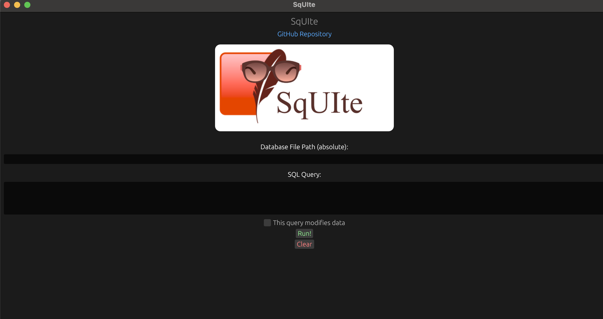
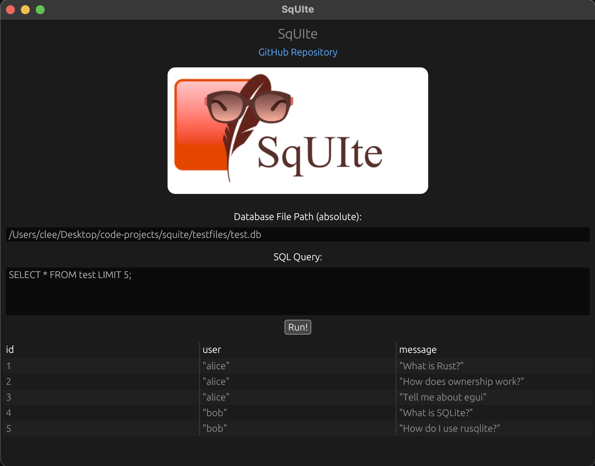

<h1 align="center">SqUIte</h1>
<h2 align="center">A UI for SQLite databases, written in Rust🦀</h2>
<div align="center">
    
</div>

**SqUIte** (pronounced like SQLite but without the 'L') is a small desktop application built to be a quick and dirty UI to visualize SQLite data.

It is built on top of [`rusqlite`](https://github.com/rusqlite/rusqlite) and [`egui`](https://github.com/emilk/egui).

## Installation And Usage

Install with Cargo:

```bash
cargo install squite
```

> In the near future, there will be a website where you will be able to download pre-compiled application binaries!

You can then run with:

```bash
squite
```

The command will open a window like this:



And you can then SQL queries on file-based SQLite databases, and obtain a table of results:



> There is one limitation: **you can only run `SELECT` statements**. This limitation might be lifted with new releases.

## Contributing

Take a look at the [contributing guidelines](./CONTRIBUTING.md) to get started with your first contribution!

## License

This project is provided under [MIT license](./LICENSE).
