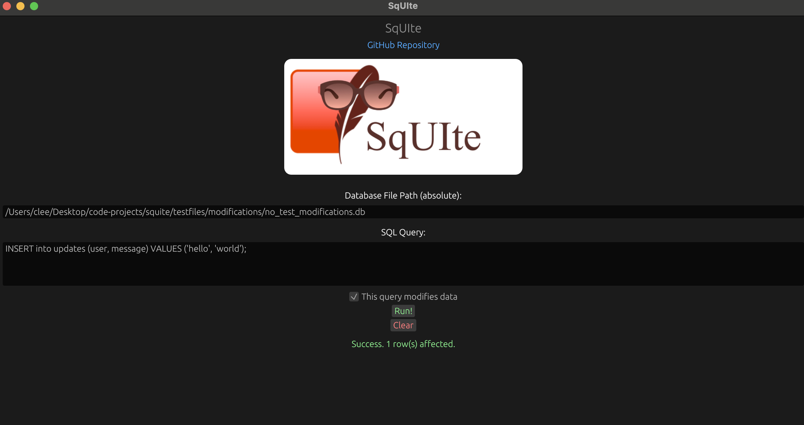
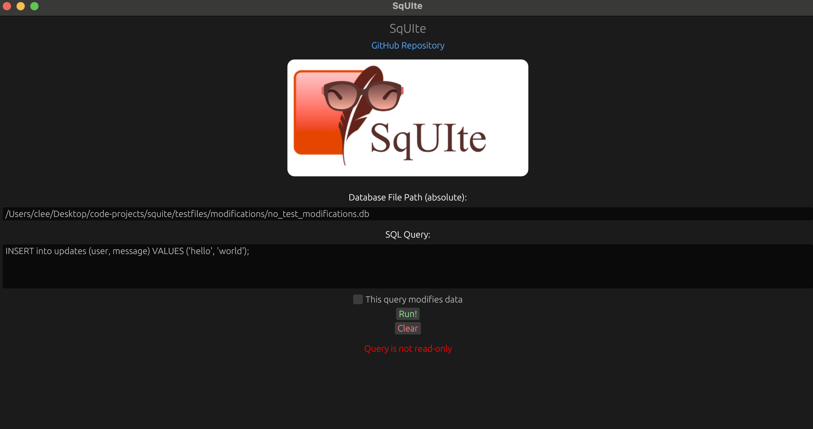

<h1 align="center">SqUIte</h1>
<h2 align="center">A UI for SQLite databases, written in Rust🦀</h2>
<div align="center">
    
</div>

**SqUIte** (pronounced like SQLite but without the 'L') is a small desktop application built to be a quick and dirty UI to visualize SQLite data.

It is built on top of [`rusqlite`](https://github.com/rusqlite/rusqlite) and [`egui`](https://github.com/emilk/egui).

## Installation

Install with Cargo:

```bash
cargo install squite
```

Or download the app (for MacOS and Ubuntu/Debian, AMD64 only) from the [website](https://squite.de).

## Usage

If you installed with Cargo, you can run with:

```bash
squite
```

Otherwise you can simply double-click on the app icon.

The app will open to a window like this:


You can then run SQL `SELECT` statements on file-based SQLite databases, and obtain a table of results:


Or you can run statements that modify data (such ass `INSERT`, `UPDATE` or `DELETE`), and get the number of affected rows:



Note that statements that modify data require you to check the *"This query modifies data"* checkbox, to acknowledge that you are performing a potentially destructive or irreversible operation. If the checkbox is left unchecked, the operation will be rejected.



## Contributing

Take a look at the [contributing guidelines](./CONTRIBUTING.md) to get started with your first contribution!

## License

This project is provided under [MIT license](./LICENSE).
